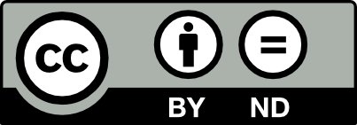
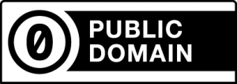
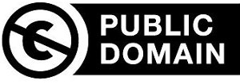

## Module: Applying Licenses to OER Projects

### Why it Matters
> This module provides context for faculty developers of original and remixed OER content primarily for Composition, Rhetoric, and Public Speaking/Mass Communication courses. In addition to differentiating the different licenses applied to content and courseware tools, this module will help ensure that faculty developers make informed decisions about how to license their creations.

### Learning Outcomes
In this module, you will:
- **Identify** the six Creative Commons licenses
- **Differentiate** the four license elements of Creative Commons licenses
- **Identify** other common free culture licenses 
- **Apply** free culture licenses to new work

## 1. Free Culture Licenses
Though the six Creative Commons licenses are the most popular for Open Educational Resource projects, there are a number of other open/free culture licenses that a content developer may encounter. Most of these licenses have a common history. The invention of the term "free license" and the focus on the rights of users were connected to the sharing traditions of the hacker culture of the 1970s public domain software ecosystem, the social and political free software movement (since 1980) and the Open source movement (since the 1990s).

Free culture licenses can be classified by **freedom**, **type of content**, and relationship to **authors**. 

### Learn By Doing

Explore the hotspots in the image below to learn about some of the popular non-Creative Commons licenses

<iframe src="https://h5p.cwr.olemiss.edu/h5p/embed/76" width="100%" height="414" frameborder="0" allowfullscreen="allowfullscreen"></iframe>

Though you probably won't encounter these licenses in most of your OER work, they are an important part of the free culture ecosystem. This is especially important when considering how to integrate content with courseware and other publishing platforms. For example, all of the code for the H5P exercises and activities in this module are licensed under the [MIT and GPL licenses](https://h5p.org/licensing) (depending on the components used). 

## 2. The Creative Commons Licenses 

#### The Structure of a CC License
All CC licenses have three basic layer: the legal code, the human-readable deed, and the machine-readable metadata. 

<iframe src="https://h5p.cwr.olemiss.edu/h5p/embed/77" width="688" height="840" frameborder="0" allowfullscreen="allowfullscreen"></iframe>

There are four possible components to each Creative Commons license type. The components can be arranged into six different standard licenses. Explopre the hotspots below to learn about each of the four basic components. 

<iframe src="https://h5p.cwr.olemiss.edu/h5p/embed/67" width="300" height="600" frameborder="0" allowfullscreen="allowfullscreen"></iframe>

Creative Commons licenses are standardized tools, but part of the vision is to provide a range of options for creators who are interested in sharing their works with the public rather than reserving all rights under copyright.

The four license elements—BY, SA, NC, and ND—combine to make up six different license options.

All of the licenses include the BY condition. In other words, all of the licenses require that the creator be attributed in connection with their work. Beyond that commonality, the licenses vary whether (1) commercial use of the work is permitted; and (2) whether the work can be adapted, and if so, on what terms.

What are the reasons you might choose to use each one of the six licenses in your OER project? 

---

 

The Attribution license or “CC BY” allows people to use the work for any purpose (even commercially and even in modified form) as long as they give attribution to the creator. This is the most permissive of the CC licenses, and it's compatible with all the other non-ND licenses. 

Though it might seem like “most permissive” is the same as “most free,” this isn’t necessarily the case. For content creators, one potential drawback with this license type is that your work could be incorporated into proprietary, copyright-locked work (like a textbook) from which it could not be easily shared further.

---

 

The Attribution-ShareAlike license or “BY-SA” allows people to use the work for any purpose (even commercially and even in modified form), as long as they give attribution to the creator and make any adaptations they share with others available under the same or a compatible license. 

This is CC’s version of a copyleft license, and is the license required for content uploaded to Wikipedia, for example. This is the "most free" of the CC licenses, and is the most flexible and equitable license for OER-use. Someone could still incorporate your content into a proprietary textbook, for example, but this license remains attached to it, and the new content could still be remixed and destributed based on the original license terms. 

---

 

The Attribution-NonCommercial license or “BY-NC” allows people to use the work for noncommercial purposes only, and only as long as they give attribution to the creator. The NC license presents some potential issues for OER content creators. 

For one, "commercial use" is difficult to define. Do you consider a university class a commercial use? Students pay tuition and recieve course credit in exchange: by some definitions, that is a commercial use. NC licneses also lend themselves to [orphan works](https://www.stallman.org/articles/online-education.html) because commercial use is so difficult to identify over time. 

---

 

The Attribution-NonCommercial-ShareAlike license or “BY-NC-SA” allows people to use the work for noncommercial purposes only, and only as long as they give attribution to the creator and make any adaptations they share with others available under the same or a compatible license. 

The NC-SA license has the same "orphan works" problem as the basic NC license. There is no practical mechanism to ensure the long-term sustainability of the license. 

---

 

The Attribution-NoDerivatives license or “BY-ND” allows people to use the unadapted work for any purpose (even commercially), as long as they give attribution to the creator. The ND licenses are the most frustrating for OER content creators. 

Because ND works cannot be adapted, it's very difficult to incorporate them into a larger OER project. I could not, for example, incorporate a single chapter from an existing OER textbook into my own OER textbook. Unless I want to include the entire text, the most I could do is link out to the section I want my students to read. There are many valid uses for ND, of course, especially when it comes to published research. Generally, though, if you want others to be able to use your work to the maxmium extent possible, you should avoid ND licenses. 

---

[CC-BY-ND-NC](media/by-nc-nd.png)

The Attribution-NonCommercial-NoDerivatives license or “BY-NC-ND” is the most restrictive license offered by CC. It allows people to use the unadapted work for noncommercial purposes only, and only as long as they give attribution to the licensor.

### Show What you Know: License Quiz   
<iframe src="https://h5p.cwr.olemiss.edu/h5p/embed/70" width="830" height="411" frameborder="0" allowfullscreen="allowfullscreen"></iframe>

## 3. The Public Domain
When a work is in the public domain, it is free for use by anyone for any purpose without restriction under copyright law. Public domain is the purest form of open/free, since no one owns or controls the material in any way.

Works that are in the public domain in one legal jurisdiction are not necessarily in the public domain worldwide. Copyright laws differ from jurisdiction to jurisdiction, both in duration of protection and what constitutes copyrightable subject matter.

Creative Commons licenses do not affect the status of a work that is in the public domain under applicable law, because the licenses only apply to works that are protected by copyright.

Creative Commons offers two Public Domain tools for content creators: the CC0 mark and the Public Domain Mark. Though they may seem identical, there are some important legal and philosophical differences. 

|| 
|----|----|
|CC0 enables scientists, educators, artists and other creators and owners of copyright- or database-protected content to waive those interests in their works and thereby place them as completely as possible in the public domain, so that others may freely build upon, enhance and reuse the works for any purposes without restriction under copyright or database law. | The PDM is intended for use with old works that are free of copyright restrictions around the world, or works that have been affirmatively placed in the worldwide public domain prior to the expiration of copyright by the rights’ holder. It should not be used to mark works that are in the public domain in some jurisdictions while known to be restricted by copyright in others. 

### Applying CC0 to your own work
The CC0 legal code also uses a three-pronged legal approach. Some countries do not allow creators to dedicate their work to the public domain through a waiver or abandonment of those rights, so CC0 includes a “fall back” license that allows anyone in the world to do anything with the work unconditionally. The fall back license comes into play when the waiver fails for any reason. And finally, in the rare instance that both the waiver and the “fall back” license are not enforceable, CC includes a promise by the person applying CC0 to their work that they will not assert copyright against reusers in a manner that interferes with their stated intention of surrendering all rights in the work.

Like the licenses, CC0 is a copyright tool, but it also covers a few additional rights beyond those covered by the CC licenses, such a non competition laws. From a reuse perspective, there still may be other rights that require clearance separately, such as trademark and patent rights, and third party rights in the work, such as publicity or privacy rights.

In jurisdictions that do not recognized the public domain, the CC0 mark acts as a legal free license. 

Keep in mind that you cannot waive rights to a work that you do not own unless you have permission from the owner.

### Public Domain works you don't own
Whether or not an existing work is in the public domain is a more complicated question than it should be. The basic rule for copyright expiration is the author's life plus 70 years, but it really depends on when the work was originally created and if the copyright owner is a person or an organization.

Cornell University Library's Copyright Information Center provides an excellent table about [Copyright Term and Public Domain in the United States](https://copyright.cornell.edu/publicdomain).

Creative Commons does not recommend the Public Domain mark for work with jurisdictional copyright discrepancies. The CC0 mark, which has a fall-back function as a free license, is a better choice. 

#### Major Differences between CC0 and the Public Domain Mark

| Features                                                     | Public Domain Mark                                                                                                                                                                                      | CC0 Public Domain Dedication                                                                                                                                                              | 
|--------------------------------------------------------------|---------------------------------------------------------------------------------------------------------------------------------------------------------------------------------------------------------|-------------------------------------------------------------------------------------------------------------------------------------------------------------------------------------------| 
| Nature of tool                                               | Label for works already in the worldwide public domain                                                                                                                                                  | Tool that effectively places a work in the worldwide public domain                                                                                                                        | 
| Who may use                                                  | Anyone with knowledge                                                                                                                                                                                   | Rights holder ("affirmer")                                                                                                                                                                | 
| Scope                                                        | "Copyright, including all related and neighboring rights"                                                                                                                                               | "Copyright, including all related and neighboring rights"                                                                                                                                 | 
| Legal status of work to which tool may be applied            | "Any work that is already free of known copyright worldwide, including all neighboring and related rights"                                                                                              | "Any work that is restricted by affirmer's copyright or neighboring and related rights, in one or more jurisdiction(s)" |                                                             
| Definition of related and neighboring rights                 | Not provided (PDM does not have accompanying legal code)                                                                                                                                                | "Yes, an illustrative and non exhaustive list of any and all such rights however characterized is contained in Section 1 of the CC0 legal code, and includes sui generis database rights" | 
|                                                                                                                                                                                                                                                                                                                                                                                                                                                                  Person(s) whose rights are affected upon application of tool | "None, PDM is not legally operative"                                                                                                                                                                    | Rights of the affirmer only; no effect on the right(s) of third parties                                                                                                                   | 
| Rights affected upon application of tool                     | "None, PDM is not legally operative"                                                                                                                                                                    | All of affirmer�s copyright and related and neighboring rights are unconditionally waived or licensed (where waiver is not effective)                                                     | 
| Rights that may exist/persist after application              | "Moral and other related and neighboring rights that persist post-expiration of applicable copyright term (but note, PDM does not attempt to affect those rights)"                                      | Moral and other related and neighboring rights of affirmer that are not waivable or licensable; Any and all third party rights                                                                                                                                                            | 
| Effect on work itself upon application                       | "None, PDM is not legally operative but instead labels a work already free of known copyright and related and neighboring rights through means such as expiration of term of applicable copyright term" | "Places work as closely as possible in the public domain, worldwide"                                                                                                                      | 

#### Check your Understanding: CC0 vs. Public Domain mark

Match the correct mark with each scenario. 
<iframe src="https://h5p.cwr.olemiss.edu/h5p/embed/80" width="689" height="432" frameborder="0" allowfullscreen="allowfullscreen"></iframe>

## 4. Adapting Work for OER Projects   
If you find content that is licensed for adaptation (CC-BY, CC-BY-SA, and possibly CC-BY-NC), how should you go about adapting it? What does "adaptation" even mean for OER? 

As a legal matter, at times it is tricky to determine exactly what is and is not an adaptation. Here are some handy rules about the licenses to keep in mind:

- Technical format-shifting (for example, converting a licensed work from a digital format to a physical copy) is not an adaptation regardless of what applicable copyright law may otherwise provide.
- Fixing minor problems with spelling or punctuation is not an adaptation.
- Syncing a musical work with a moving image is an adaptation regardless of what applicable copyright law may otherwise provide.
- Reproducing and putting works together into a collection is not an adaptation of the individual works. For example, **combining stand-alone essays by several authors into an essay collection** for use as an open textbook is a collection and not an adaptation. 
- Including an image in connection with text, as in a blog post, a powerpoint, or an article, does not create an adaptation unless the photo itself is adapted.

One of the affordances of OER is the ability to remix content. You may find that there are elements from three different OER texts that you want to provide your students. As long as the licenses permit it, you can mix all three texts together and add your own scaffolding to create a text that's custom-fit for your own students. 

### Explore an Adapted OER  

Spend some time exploring the sample OER content below. It combines original text and activities with adapted content from [OER Commons](https://www.oercommons.org/).  
<iframe src="https://h5p.cwr.olemiss.edu/h5p/embed/78" width="688" height="713" frameborder="0" allowfullscreen="allowfullscreen"></iframe>

Now, answer a couple of questions about how Creative Commons licenses are used in this OER:

<iframe src="https://h5p.cwr.olemiss.edu/h5p/embed/79" width="688" height="291" frameborder="0" allowfullscreen="allowfullscreen"></iframe>

## Module Quiz 

### CC licensed content, Specific attribution
- Anatomy of a CC License . Provided by: Creative Commons. Located at: [https://certificates.creativecommons.org/cccertedu/chapter/3-anatomy-of-a-cc-license/](https://certificates.creativecommons.org/cccertedu/chapter/3-anatomy-of-a-cc-license/). Project: Creative Commons Certificate for Educators and Librarians. License: CC BY: Attribution

- CC0 ODM comparison chart. Provided by: Creative Commons. Located at: [https://wiki.creativecommons.org/wiki/CC0_PDM_comparison_chart](https://wiki.creativecommons.org/wiki/CC0_PDM_comparison_chart). License: CC-BY 4.0

- Free license. Provided by: Wikipedia. Located at: [https://en.wikipedia.org/wiki/Free_license](https://en.wikipedia.org/wiki/Free_license). License: CC-BY-SA

- Network of licenses (and years of license creation). Provided by Kristina Bokan. Located at: [https://en.wikipedia.org/wiki/Open-license#/media/File:License_network_by_bokanko.jpg](https://en.wikipedia.org/wiki/Open-license#/media/File:License_network_by_bokanko.jpg). License: CC-BY 3.0

- Public Domain Tools. Provided by: Creative Commons. Located at: [https://creativecommons.org/publicdomain/](https://creativecommons.org/publicdomain/). License: CC-BY  4.0

- Public Domain. Provided by: Creative Commons. Located at: [https://wiki.creativecommons.org/wiki/Public_domain](https://wiki.creativecommons.org/wiki/Public_domain). License: CC-BY 4.0

---------------
 This work is licensed under a <a rel="license" href="http://creativecommons.org/licenses/by-sa/4.0/">Creative Commons Attribution-ShareAlike 4.0 International License</a>.

See this module's [Github Repository](https://github.com/adavis46/cccert_assignment3) to download and reuse H5P exercises. 
