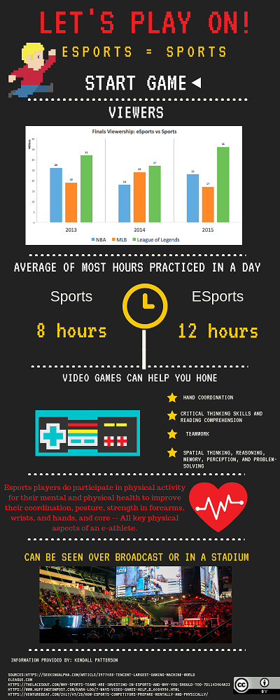

# Collection: Digital Media Infographics

## Introduction
This collection represents sample student work between 2018 and 2019. Students in a junior-level digital composition class were required to create infographics connecting their area of research interest to digital media studies. Students used a variety of platforms to create these infographics, and part of the assignment was to choose a license for the final product. Most students chose one of the Creative Commons licenses discussed in class, but others did choose to maintain their "All Rights Reserved" copyright. The assignment description, below, describes how students went about choosing and justifying their licenses. Spend some time reading the assignment description, and decide for yourself how well the infographics in the collection followed the guidelines. 
## The Assignment

<iframe src="https://nbviewer.jupyter.org/github/adavis46/cccert_assignment4/blob/master/media/project.pdf" width="100%" height="750px"></iframe>

### Attribution
"Information Design." Provided by: Andrew Davis. Located at: [https://docs.google.com/document/d/1ZqX9Y5uM18eeI3obk89oCIge61yLdclL-qzbb_ZR2bU/edit?usp=sharing](https://docs.google.com/document/d/1ZqX9Y5uM18eeI3obk89oCIge61yLdclL-qzbb_ZR2bU/edit?usp=sharing). License: CC-BY-SA 4.0 

## Infographics

||  
|----|----|  
||      
|----|----| 

### Attributions
- "Easy Tips to Be an Educated Media Consumer in the age of Fake News." Provided by: Hadley Hitson. Located at: [https://adavis46.github.io/cccert_assignment4/media/2.jpg](https://adavis46.github.io/cccert_assignment4/media/2.jpg) License: CC-BY-ND

- "Impact of Reddit on Users' Mental Health." Provided by: Brant Akins. Located at: [https://adavis46.github.io/cccert_assignment4/media/5.png](https://adavis46.github.io/cccert_assignment4/media/5.png) License: CC-BY-ND

- "Let's Play On! Esports = Sports." Provided by: Kendall Patterson. Located at: [https://adavis46.github.io/cccert_assignment4/media/4.png](https://adavis46.github.io/cccert_assignment4/media/4.png) License: CC-BY

- "Digital Media and Meal Time." Provided by: Sophia DePasquale. Located at: [https://adavis46.github.io/cccert_assignment4/media/1.png](https://adavis46.github.io/cccert_assignment4/media/1.png) License: CC-BY-SA

---
 This collection is licensed under a <a rel="license" href="http://creativecommons.org/licenses/by/4.0/">Creative Commons Attribution 4.0 International License</a> unless indicated otherwise. 

