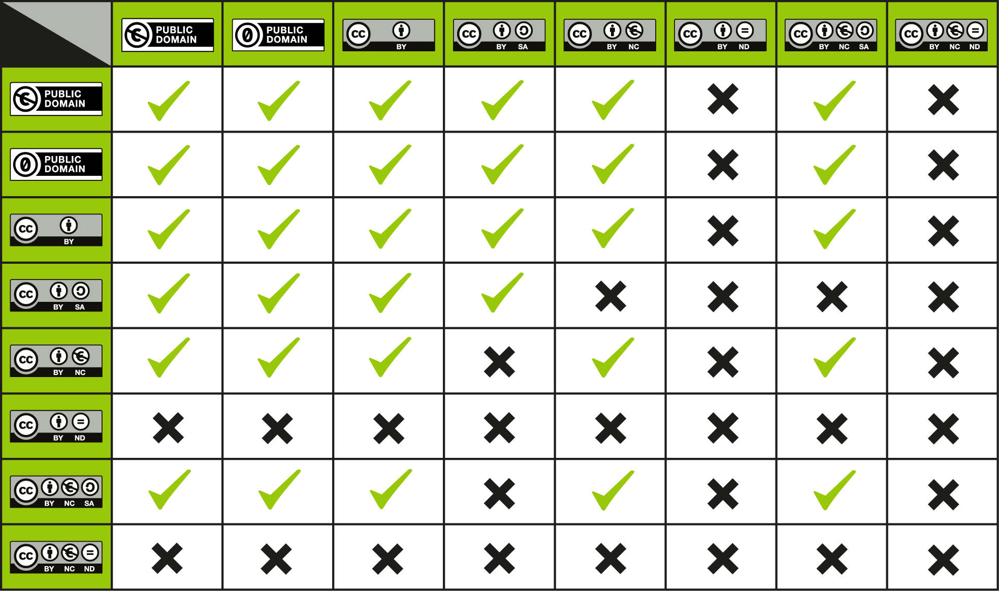

## Module: Collections and Remixes

### Why it Matters
> This module provides context about collections and remixes for faculty OER developers of Rhetoric, Composition, and Speech Communication content. The distinction between collections and remixes is especially important for new OER projects that are primarily based on existing OER, as developers must take into account license compatibility and future uses of the new content being developed. 

### Learning Outcomes
In this module, you will:
- **Define** collections 
- **Define** remixes
- **Differentiate** collections and remixes
- **Apply** compatible licenses to new OER projects

## 1. Collections   
In general, for your OER work a **collection** is analogous to an **anthology**. If your project combines unmodified texts, media, or other content in single location with only basic non-adaptive format changes, it is considered a collection. For example, if you are developing a Literature OER, you might create an anthology of several different short stories, poems, and essays. These individual texts keep their original licenses 

When you create a collection, you must provide attribution and licensing information about the individual works in your collection. This gives the public the information they need to understand who created what and which license terms apply to specific content. 

When you combine material into a collection, you may have a separate copyright of your own that you may license. However, your copyright only extends to the new contributions you made to the work. In a collection, that is the selection and arrangement of the various works in the collection, and not the individual works themselves. For example, you can select and arrange pre-existing learning obects created by others into an anthology, write an introduction, and design a cover for the collection, but your copyright and the only copyright you can license extends to your arrangement of the original learning objects (not the objects themselves), and your original introduction and cover. 

If the learning objects have a CC-BY-ND license, or any variation of it, you cannot modify them in any way and you must include them in their entirety. This matters especially if you find a complete OER textbook that you like with an ND license. Technically, the only way to include it in a collection is to include the **entire** work. Others have rationalized including complete chapters of ND works, but this is definitely a questionable practice if you pay close attention to the license terms. 

The safest way to include part of an ND-licensed textbook in your own project is to link out to it. 

### General Rules for Collections
- If the underlying work is licensed under a NoDerivatives license, you can make and use changes privately but you cannot share your adaptation with others, as discussed above. **Sharing it with your students is a public use** and violates the license terms. 

- If the underlying work is licensed under a ShareAlike license, then ShareAlike applies to your adaptation and you must license it under the same or a compatible license. 

- In all cases, you have to attribute the original work when you create an adaptation.

### Sample Collection
Take a look at [this collection](collection.md) of student designed infographics about digital media. 

## 2. Remixes
If your OER project goes beyond simply combining unmodified content, it's a **remix**. You may, for example, update the examples in an OER text to be more relevant to your students, or adjust the organization of a chapter to better align to your curriculum. Even if you just want to insert a single chunk of content from another source and integrate it into your own OER text, it's probably considered a remix. This is especially important to remember if you're working with **CC-BY-ND** works. 

Remix is at the core of the OER movement (and is one of the [5 R's of OER](https://opencontent.org/blog/archives/355)). Remixes ensure that knowledge work in open content is never static and never becomes stale. In Composition, one of the most common complaints about tradition, proprietary textbooks and handbooks is that they do not align exactly with local curriculum. Faculty rightfully feel guilty about requiring a student to purchase a textbook where only 60% of the content is relevant. OER remixes present a good solution to that problem. OER faculty developers, like you, might combine 60% of an openly-licensed OER text with 20% of another OER text and write 20% new content. The result is a new OER text that is perfectly aligned to your curricular needs. Furthermore, by openly licensing your new work and making it available to the larger Composition community, you're making it possible for another faculty developer down the road to repeat the cycle. 

Remix is also the primary answer to the complaint that there isn't enough OER content in the fields of Composition, Rhetoric, and Mass Communication. The early adopters may have to do more legwork, sure, but eventually there can be enough raw material out there for any interested faculty developer to quickly assemble an ideal OER text for their specific needs. 

Take a look at this remix of [Advanced Composition content](https://hyp.is/go?url=https%3A%2F%2Fcourses.lumenlearning.com%2Folemiss-writ250%2Fchapter%2Fsearch-tools-databases%2F). Click on the highlights to explore the original sources. 

### License Compatibility
The most important thing to consider when creating an OER remix is license compatibility. Whatever license you apply to your new creation must be compatible with the licenses of the constituent parts. In the example linked above, the original work has a **CC-BY** license. It is remixed with two other works; one has a **CC-BY** license and the other has a **CC-BY-NC** license. Because this project was developed in cooperation with [Lumen Learning](http://www.lumenlearning.com), the entire work uses Lumen's copyright disclaimer:

> This courseware includes resources copyrighted and openly licensed by multiple individuals and organizations. Click the words "Licenses and Attributions" at the bottom of each page for copyright and licensing information specific to the material on that page. If you believe that this courseware violates your copyright, please contact us. 

However, faculty developers agreed to license all original content CC-BY, to ensure maximum license compatibility, so they consider the entire project to have a CC-BY license. 

Take a look at the Creative Commons license compatibility chart to see how different licenses work together: 

The faculty developers of the example Advanced Composition textbook above discussed licenses at length, and though they preferred the **CC-BY-SA** license, much of the content they wanted to remix included **CC-BY-NC** licenses, which are not compatible. This is worth remembering when creating new content. The **CC-BY-NC** license may sound very appealing, but it can present roadblocks to future content creators who want to remix your work. 

### Learn By Doing: Create your own Remix

<iframe src="https://h5p.cwr.olemiss.edu/h5p/embed/84" width="100%" height="549" frameborder="0" allowfullscreen="allowfullscreen"></iframe>

### Sample Remix

Take a look at [this sample remix](https://hyp.is/go?url=https%3A%2F%2Fadavis46.github.io%2Fcccert_assignment4%2Fremix.html) based on the Learn By Doing activity above. Click on the highlighted text to explore how the different sources have been remixed. 

## Attributions

- "4.4 Remixing CC-Licensed Works." Provided by: Creative Commons. Located at: [https://certificates.creativecommons.org/cccerteducomments/chapter/4-4-remixing-cc-licensed-work/](https://certificates.creativecommons.org/cccerteducomments/chapter/4-4-remixing-cc-licensed-work/). License: CC-BY 4.0

- "CC License Compatibility Chart." Provided by: Creative Commons. Located at: [https://creativecommons.org/faq/#can-i-combine-material-under-different-creative-commons-licenses-in-my-work](https://creativecommons.org/faq/#can-i-combine-material-under-different-creative-commons-licenses-in-my-work). License: CC-BY 4.0

---------------
 This work is licensed under a <a rel="license" href="http://creativecommons.org/licenses/by-sa/4.0/">Creative Commons Attribution-ShareAlike 4.0 International License</a> except where otherwise noted. 

See this module's [Github Repository](https://github.com/adavis46/cccert_assignment3) to download and reuse H5P exercises. 
